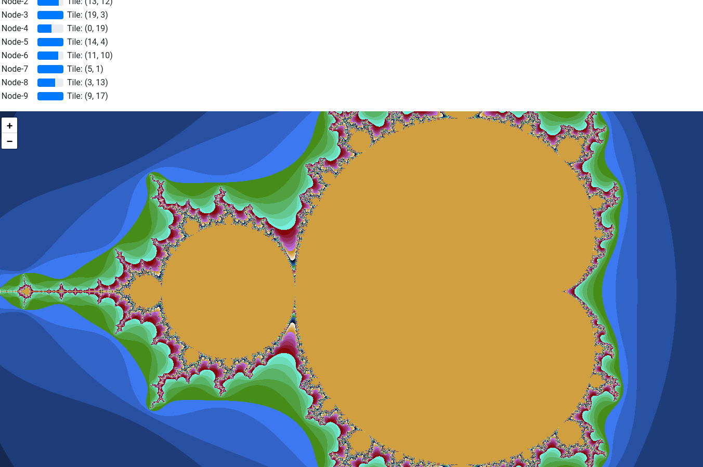

# Mandelbrot

## Overview

This is an interactive visualization of the mandelbrot set.

This branch is meant for setting up websocket and REST communication.
To build install the [C++ REST SDK](https://github.com/Microsoft/cpprestsdk).

## Getting Started

> TODO

## Links

> Spezifikation

> Ausarbeitung