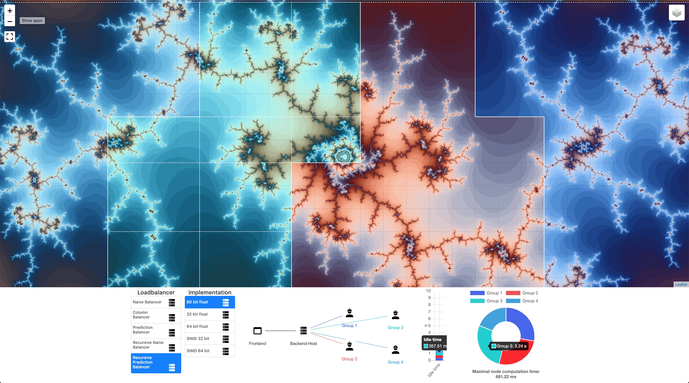

# Interactive Mandelbrot Visualization

Mandelbrot was developed during a two semester Project at the CAPS chair of TUM.
It shows the possible speedup which can be achieved by parallelization on a cluster of independent compute nodes.



## Getting Started

The Application is split into a backend computing the mandelbrot set and a frontend displaying that data and serving as a user interface.
A hosted version of this can be found
[here](https://eragp.github.io/mandelbrot/).

### Running the application

1.  Start the backend either locally using the provided docker image from from `backend/run_docker.sh`
    (requires Docker, python to be installed)

    This starts the backend server with 37 processes at `ws://localhost:9002

    **OR**

    If you have access to the [himmuc](https://www.caps.in.tum.de/himmuc/) cluster from the CAPS chair, you can also use that as the backend:

    ```bash
    backend/run_himmuc.sh -b -p odr [rechnerkennung] [processes] [nodes]
    ```

    This will build the backend and start a job on the himmuc with #processes on #nodes.
    The server will then be port forwarded to `ws://localhost:9002`

2.  Start the frontend either locally with `npm` (see `doc/Ausarbeitung` for more details) or use the hosted version
    [here](https://eragp.github.io/mandelbrot/).

    If you have started the backend at another url than 'localhost:9002' you can specify the backend to use with the `backend=` html get parameter in the mandelbrot URL.

    ```
    https://eragp.github.io/mandelbrot?backend=ws://[URL]:[PORT]
    ```

## More Info

For more info see the full documentation of the project (in german) at `doc/Ausarbeitung Mandelbrot ERAGP - Finale Ausarbeitung.pdf`
